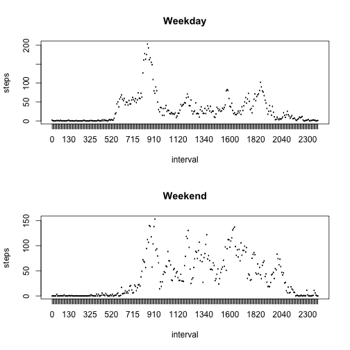

# Reproducible Research - Peer Assignment nr. 1 
Author: Federico Della Bella
Milan (It) - Sunday, 19 July 2015


## Introduction
This assignment makes use of data from a personal activity monitoring device. This device collects data at 5 minute intervals through out the day. The data consists of two months of data from an anonymous individual collected during the months of October and November, 2012 and include the number of steps taken in 5 minute intervals each day.

## Data
The data for this assignment can be downloaded from the course web site:

- Dataset: Activity monitoring data [52K]

The variables included in this dataset are:

- steps: Number of steps taking in a 5-minute interval (missing values are coded as NA)

- date: The date on which the measurement was taken in YYYY-MM-DD format

- interval: Identifier for the 5-minute interval in which measurement was taken

The dataset is stored in a comma-separated-value (CSV) file and there are a total of 17,568 observations in this dataset.


# R preparations
Call library knitr and set the global option (echo = TRUE), in order to show the code used to get final results


```r
library(knitr)
opts_chunk$set(echo = TRUE)
library(ggplot2)
```


# 1. Loading and Processing Data
The first thing to do is to unzip the file "activity.csv" containing the data (if not already unzipped) and to read data


```r
if(!file.exists('activity.csv')){
        unzip('activity.zip')
}
dataStep <- read.csv("activity.csv")
```

To understand what types of data we have to manage, we do some quick exploration:


```r
head(dataStep)
```

```
##   steps       date interval
## 1    NA 2012-10-01        0
## 2    NA 2012-10-01        5
## 3    NA 2012-10-01       10
## 4    NA 2012-10-01       15
## 5    NA 2012-10-01       20
## 6    NA 2012-10-01       25
```

```r
str(dataStep)
```

```
## 'data.frame':	17568 obs. of  3 variables:
##  $ steps   : int  NA NA NA NA NA NA NA NA NA NA ...
##  $ date    : Factor w/ 61 levels "2012-10-01","2012-10-02",..: 1 1 1 1 1 1 1 1 1 1 ...
##  $ interval: int  0 5 10 15 20 25 30 35 40 45 ...
```

```r
summary(dataStep)
```

```
##      steps                date          interval     
##  Min.   :  0.00   2012-10-01:  288   Min.   :   0.0  
##  1st Qu.:  0.00   2012-10-02:  288   1st Qu.: 588.8  
##  Median :  0.00   2012-10-03:  288   Median :1177.5  
##  Mean   : 37.38   2012-10-04:  288   Mean   :1177.5  
##  3rd Qu.: 12.00   2012-10-05:  288   3rd Qu.:1766.2  
##  Max.   :806.00   2012-10-06:  288   Max.   :2355.0  
##  NA's   :2304     (Other)   :15840
```

We also want to be sure that the data in the columns date and interval are in the proper format, which means that they should be date type and factor type


```r
dataStep$date <- as.Date(dataStep$date, format = "%Y - %m - %d")
dataStep$interval <- as.factor(dataStep$interval)
```


# 2.  What is the total number of steps taken per day?
The first question you are asked to respond is what are the steps that are taken every day analysed.
The question is divided into 3 parts. In the first, it is requested to calculate  the total number of steps taken per day; in the second, it is requested to do an histogram of the total number of steps taken each day, and finally, in the third to calculate mean and median of the total number of steps taken per day.

In order to do this, the first step is to use the function tapply, to apply the function "sum" to subsets of the data, subsetting per date, and removing Na values.


```r
stepsbyDay <- tapply(dataStep$steps, dataStep$date, sum, na.rm = TRUE)
```

Now, it is possible to plot the histogram, and thus the frequency of each occurence of total number of steps taken per day


```r
qplot(stepsbyDay, xlab='Total steps per day', ylab='Frequency', binwidth=500)
```

 

Finally, we can calculate and print the mean and the median of total number of steps taken per day.


```r
meanSteps <- round(mean(stepsbyDay))
medianSteps <- round(median(stepsbyDay))
```

The average number of steps taken per day is 9354.

The median number of steps taken per day is 1.0395 &times; 10<sup>4</sup>

# 3. What is the average daily activity pattern? 
In this section, we have been requested to:
- make a time series plot (i.e. type = "l") of the 5-minute interval (x-axis) and the average number of steps taken, averaged across all days (y-axis)
- tell which 5-minute interval, on average across all the days in the dataset, contains the maximum number of steps?

In order to accomplish this task, we have aggregated the data by interval using "aggregate" function, applying the mean function to each level, then plotting the data, and answering the question which is the 5-minute interval containing the maximum number of steps, and how many steps it contains.


```r
averageStepsperInterval <- aggregate(dataStep$steps, by = list(interval = dataStep$interval), FUN = mean, na.rm = TRUE)
colnames(averageStepsperInterval) <- c("interval", "meanSteps")
averageStepsperInterval$interval <- as.integer(levels(averageStepsperInterval$interval)[averageStepsperInterval$interval])
ggplot(data = averageStepsperInterval, aes(x = interval, y = meanSteps)) + geom_line(color = "green", size = 1) + xlab("5 minute interval") + ylab("average number steps per interval") + theme_bw()
```

 

```r
maxInterval <- averageStepsperInterval[which.max(averageStepsperInterval$meanSteps), ] 
intervalMax <- maxInterval$interval
stepsMax <- round(maxInterval$meanSteps)
```

The interval with the maximum number of step is 835, with 206 steps.

# 4. Imputting missing values
Previous analysis have been done without considering the effect of missing (Na) values. In this section, we are requested to adopt a strategy to manage missing values and to question the effect it has on median and mean of the day.

The first question is the number of missing values present in the dataset. This is a task resolved through a couple of lines of code. In the first, with the function "is.na", we create a vector of Na values; then, with the function "length", we can calculate the number of missing value.


```r
valuesNa <- dataStep$steps[is.na(dataStep$steps)]
numberNa <- length(valuesNa)
```

In the original dataset, the total number of missing values is: 2304.

The strategy adopted to fill the missing values, it is quite straightforward. We have decided to fill the missing values with the mean of the day.
In order to do this, we programmed a function, "fillData.R"

The function "fillData.R" receives as argument the dataset with missing values, and return a new dataset with a subsitution of missing values with the average of the specific day. The problem is resolved creating a new data.fram with the same dimension and with the same number of steps if present in the passed data.frame, or with the mean in case the number of steps is missing. The function "tapply" makes possible to calculate the mean on subset of data, divided by date, and then, through a check on every row of the data.frame, the new data.frame receives the correct data.


```r
fillData <- function(dataStep){    
        newData <- dataStep
        meanVect <- tapply(dataStep$steps, dataStep$date, FUN = mean, na.rm = TRUE)
        meanVect[is.na(meanVect)] <- 0
        max <- length(dataStep$steps)
        for (i in 1:max) {
                if (!is.na(dataStep$steps[i])) {
                        newData$steps[i] <- dataStep$steps[i]
                }else {
                        newData$steps[i] <- meanVect[which(as.character(names(meanVect)) == as.character(newData$date[i]))]
                }
        }
        return(newData)
}
```

Now, that we have defined the function to substitute missing data, we can simply call the function "fillData.R" to the original data.frame and to assign the returned value to the new one.


```r
source("fillData.R")
newData <- fillData(dataStep)
```

In order to show that the new data.frame differs from the old one, we just show the header and the tail of the new data.frame.


```r
head(newData)
```

```
##   steps       date interval
## 1     0 2012-10-01        0
## 2     0 2012-10-01        5
## 3     0 2012-10-01       10
## 4     0 2012-10-01       15
## 5     0 2012-10-01       20
## 6     0 2012-10-01       25
```

```r
tail(newData)
```

```
##       steps       date interval
## 17563     0 2012-11-30     2330
## 17564     0 2012-11-30     2335
## 17565     0 2012-11-30     2340
## 17566     0 2012-11-30     2345
## 17567     0 2012-11-30     2350
## 17568     0 2012-11-30     2355
```

```r
numberNa <- sum(is.na(newData$steps))
```

Through summing up "NA" values, we can see that now, the dataset has 0 missing values.

Finally, we have to plot the total number of steps taken each day and have to compare the median and the mean of the dataset with missing values with mean and median of the second dataset with filled in data.
In order to do this, we have simply repeated what's done in the step 2 of this assignment.


```r
stepsbyDay2 <- tapply(newData$steps, newData$date, sum, na.rm = FALSE) # the total steps per day
qplot(stepsbyDay2, xlab='Total steps per day 2', ylab='Frequency', binwidth=500)
```

 

```r
meanSteps2 <- round(mean(stepsbyDay2))
medianSteps2 <- round(median(stepsbyDay2))
```

We can easily see that:

- The average number of steps per day with the dataset with the missing values is: 9354. 
- The average number of steps per day with the dataset with filled-in values is: 9354.

- The median number of steps per day with the dataset with the missing values is: 1.0395 &times; 10<sup>4</sup>.
- The median number of steps per day with the dataset with filled-in values is: 1.0395 &times; 10<sup>4</sup>.

We can easily observe that the values are exactly the same. This depends on the way we have substituted missing data (with the mean of the day).

# 5. Are there differences in activity patterns between weekdays and weekends? 
This part of the assignment asks you to verify whether there ar differences between weekdays and weekends in terms of the patterns.

The first step is to add 2 columns to the original dataset. In one column, we can set the day of week of each date, and in the second we store the factor variable weekday or weekend.


```r
newData$date <-as.Date(newData$date)
newData$DayinWeek <- weekdays(newData$date)
newData$week <- ifelse(newData$DayinWeek %in% c("Monday", "Tuesday", "Wednesday", "Thursday", "Friday"), "weekday", "weekend")
newData$week <- as.factor(newData$week)
```

Finally, we can compare the 2 patterns divided by intervals. We have created 2 plots with steps in function of the interval. 


```r
stepsbyDayType <- aggregate(newData$steps ~ newData$interval + newData$week, newData, mean)
names(stepsbyDayType) <- c("interval", "weektype", "steps")
par(mfrow=c(2,1))  
with(stepsbyDayType[stepsbyDayType$weektype == "weekday",], plot(steps ~ interval, type ="l", col= "blue", main = "Weekday"))  
with(stepsbyDayType[stepsbyDayType$weektype == "weekend",], plot(steps ~ interval, type="l", col= "red", main = "Weekend"))  
```

 

Comparing the two plots, it is apparent that the two patterns are different.


